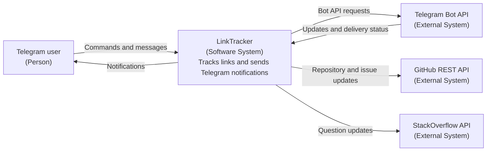
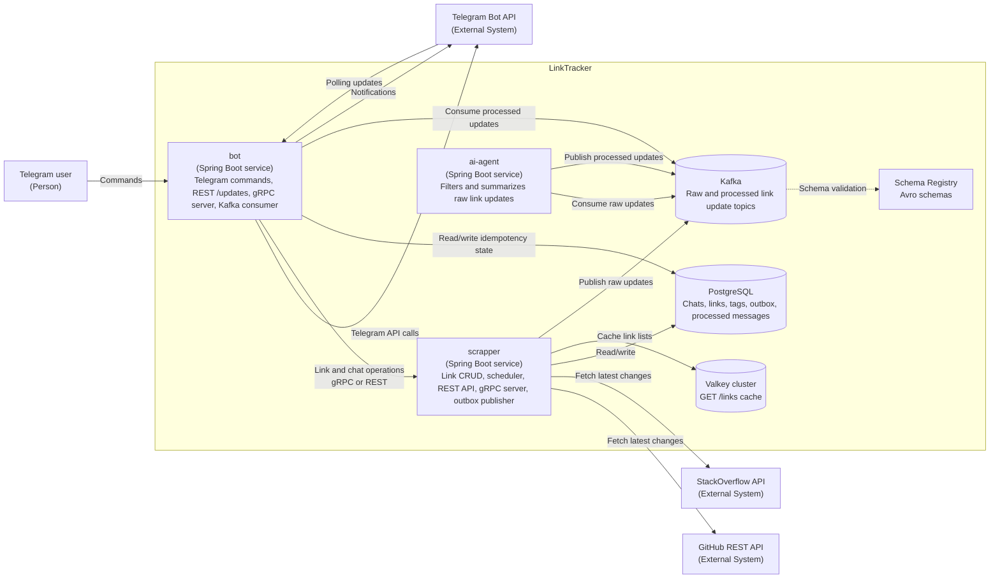
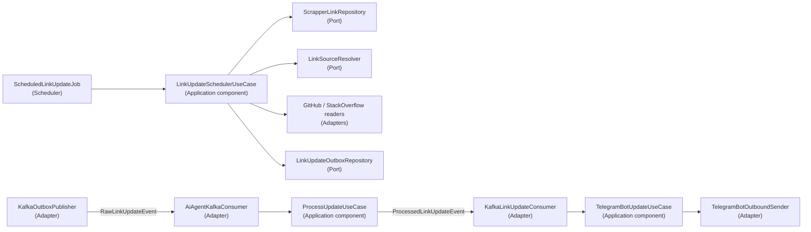

# LinkTracker

LinkTracker is a multi-service Java application for tracking GitHub repositories and StackOverflow questions, then delivering updates to Telegram.

The repository contains three runtime services:

- `scrapper`: tracks links, reads external sources, stores subscriptions, and publishes updates.
- `bot`: handles Telegram commands and sends update notifications to users.
- `ai-agent`: filters and summarizes Kafka link update events before delivery.

## Architecture

The following C4-style diagrams use Mermaid so they render directly in GitHub.

### C4 Context



### C4 Container



### C4 Component: Update Delivery Path



## Requirements

- JDK 25
- Maven Wrapper (`./mvnw`, included in the repository)
- Docker
- Docker Compose (`docker compose`)

## Root `.env` Setup

1. Copy the root environment template:

```bash
cp .env.example .env
```

2. Fill the required values:

- `TELEGRAM_TOKEN`
- `GITHUB_TOKEN`
- `STACKOVERFLOW_KEY`
- `STACKOVERFLOW_ACCESS_KEY`

3. Check the database variables and adjust them when needed:

- `POSTGRES_DB`
- `POSTGRES_USER`
- `POSTGRES_PASSWORD`
- `SPRING_DATASOURCE_URL`
- `SPRING_DATASOURCE_USERNAME`
- `SPRING_DATASOURCE_PASSWORD`

4. Choose the database access type:

```dotenv
APP_DATABASE_ACCESS_TYPE=SQL
```

Supported values are `SQL` and `ORM`.

5. Check the Scrapper `GET /links` cache settings:

- `APP_VALKEY_CLUSTER_NODES`: Valkey cluster nodes. For Docker Compose use `valkey-node-0:7000,valkey-node-1:7001,valkey-node-2:7002`; for local IDE runs use `localhost:17000,localhost:17001,localhost:17002`.
- `APP_VALKEY_TIMEOUT`: Redis/Lettuce operation timeout. Default: `2s`.
- `APP_CACHE_LIST_LINKS_ENABLED`: enables the unpaged `GET /links` cache. Default: `true`.
- `APP_CACHE_LIST_LINKS_TTL`: Valkey value TTL. Default: `10m`.

Only the unpaged link list is cached: REST `GET /links` without `limit` or with `limit=0`, and gRPC `ListLinks` with `limit=0`.
The cache key is the chat id from `Tg-Chat-Id`; paginated calls bypass the cache. After successful `POST /links`, `DELETE /links`, or chat deletion, the cache entry for that chat is removed.

Valkey read, write, and delete errors do not change the API contract. Scrapper logs the failure and continues through the repository. Error responses are not cached.

6. Configure the link-check scheduler when needed:

- `APP_SCHEDULER_LINK_PAGE_SIZE`: link batch size. Supported range: `50..500`. Default: `100`.
- `APP_SCHEDULER_WORKER_COUNT`: worker thread count. Minimum: `1`. The application default is `1`; `docker-compose.yml` sets `4` to demonstrate parallel processing.

7. Configure Scrapper -> Bot update transport:

- `APP_BOT_MODE`: default is `kafka`. Supported values: `kafka`, `grpc`, and `http`.
- Kafka uses:
  - `APP_KAFKA_BOOTSTRAP_SERVERS`
  - `APP_KAFKA_SCHEMA_REGISTRY_URL`
  - `APP_KAFKA_LINK_UPDATES_TOPIC`
  - `APP_KAFKA_LINK_UPDATES_DLQ_TOPIC`
  - `APP_KAFKA_CONSUMER_GROUP`
  - `APP_KAFKA_MAX_ATTEMPTS`
  - `APP_KAFKA_RETRY_BACKOFF`
  - `APP_KAFKA_OUTBOX_BATCH_SIZE`
  - `APP_KAFKA_OUTBOX_PUBLISH_INTERVAL`

The Bot Kafka consumer is idempotent: every notification has a stable `message-id` header and is stored in `processed_link_updates`, so repeated delivery of the same message does not duplicate the Telegram notification. Bot therefore also connects to PostgreSQL through `SPRING_DATASOURCE_URL`, `SPRING_DATASOURCE_USERNAME`, and `SPRING_DATASOURCE_PASSWORD`.

8. Configure external-call resilience and REST rate limiting when needed:

- `APP_RESILIENCE_RETRY_MAX_ATTEMPTS`: retry attempts. Default: `3`.
- `APP_RESILIENCE_RETRY_BACKOFF`: constant retry backoff. Default: `200ms`.
- `APP_RESILIENCE_RETRY_RETRYABLE_HTTP_STATUSES`: retryable HTTP statuses. Default: `500,502,503,504`.
- `APP_RESILIENCE_CIRCUIT_BREAKER_FAILURE_RATE_THRESHOLD`: circuit breaker failure threshold. Default: `50`.
- `APP_RESILIENCE_CIRCUIT_BREAKER_SLIDING_WINDOW_SIZE`: sliding window size. Default: `10`.
- `APP_RESILIENCE_CIRCUIT_BREAKER_MINIMUM_NUMBER_OF_CALLS`: minimum calls used to calculate failures. Default: `5`.
- `APP_RESILIENCE_CIRCUIT_BREAKER_PERMITTED_CALLS_IN_HALF_OPEN_STATE`: trial calls in HALF_OPEN. Default: `2`.
- `APP_RESILIENCE_CIRCUIT_BREAKER_OPEN_STATE_DURATION`: OPEN state duration. Default: `5s`.
- `APP_RESILIENCE_RATE_LIMIT_LIMIT_FOR_PERIOD`: allowed requests per IP per period. Default: `60`.
- `APP_RESILIENCE_RATE_LIMIT_LIMIT_REFRESH_PERIOD`: limit refresh period. Default: `1m`.
- `APP_RESILIENCE_RATE_LIMIT_TIMEOUT_DURATION`: wait time for a Resilience4J RateLimiter permit. Default: `0ms`.

Resilience4J-backed rate limiting applies only to public REST endpoints: Scrapper `/links`, Scrapper `/tg-chat/**`, and Bot `/updates`.
The client IP is read from the first `X-Forwarded-For` value when present; otherwise `remoteAddr` is used.

The root `.env.example` is prepared for Docker Compose, so inter-service addresses use container names such as `postgres`, `scrapper`, and `bot`.

## Run With Docker Compose

```bash
docker compose up --build
```

`docker-compose.yml` starts PostgreSQL, a 3-node Valkey cluster, a 3-broker Kafka KRaft cluster, Schema Registry, topic initialization for `link.raw-updates`, `link.processed-updates`, and their DLQs, Kafka UI, plus `scrapper`, `bot`, and `ai-agent`.

Message route: `Scrapper -> link.raw-updates -> AI Agent -> link.processed-updates -> Bot -> Telegram`.

## Run Manually Or From An IDE

1. Start infrastructure:

```bash
docker compose up -d postgres kafka-1 kafka-2 kafka-3 schema-registry topic-init
```

For Scrapper with the cache enabled, also start Valkey:

```bash
docker compose up -d valkey-node-0 valkey-node-1 valkey-node-2 valkey-cluster-init
```

2. Copy module-level environment templates with localhost addresses:

```bash
cp scrapper/.env.example scrapper/.env
cp bot/.env.example bot/.env
cp ai-agent/.env.example ai-agent/.env
```

3. Start `scrapper`:

- IDE: `com.linktracker.scrapper.ScrapperApplication`
- CLI: `./mvnw -pl scrapper spring-boot:run`

4. Start `ai-agent`:

- IDE: `com.linktracker.ai.AiAgentApplication`
- CLI: `./mvnw -pl ai-agent spring-boot:run`

5. Start `bot`:

- IDE: `com.linktracker.bot.BotApplication`
- CLI: `./mvnw -pl bot spring-boot:run`

Start PostgreSQL and Kafka first, then `ScrapperApplication`, `AiAgentApplication`, and `BotApplication`. AI Agent works from the IDE with the stub summarizer; no AI API key is required for that mode.

To temporarily disable Kafka for a manual run and use gRPC transport:

- set `APP_BOT_MODE=grpc` in `scrapper/.env`;
- set `APP_KAFKA_ENABLED=false` in `bot/.env`.

Valkey cluster nodes are named `valkey-node-0..2` inside Compose and are published as `17000..17002` on the host to avoid conflicts with macOS system services on `7000`. When running Scrapper from an IDE with `scrapper/.env.example` and localhost ports, make sure the client can resolve `valkey-node-0..2` after cluster redirects, or run Scrapper through Docker Compose.

If another Valkey cluster topology was started earlier, remove old Valkey volumes before the first run:

```bash
docker compose rm -sf valkey-node-0 valkey-node-1 valkey-node-2 valkey-cluster-init
docker volume rm link-tracker_valkey_node_0_data link-tracker_valkey_node_1_data link-tracker_valkey_node_2_data \
  2>/dev/null || true
```

## Verification Commands

Lint and static checks:

```bash
./mvnw clean compile -am spotless:check modernizer:modernizer spotbugs:check pmd:check pmd:cpd-check
```

Fast `bot` and `scrapper` tests without Testcontainers integrations:

```bash
./mvnw -pl bot,scrapper -am test
```

## Scrapper -> Kafka -> Bot Integration Check

The full message path is Scrapper -> Transactional Outbox -> Kafka -> Bot -> Telegram. It is covered by an end-to-end Testcontainers test and requires Docker:

```bash
./mvnw -pl bot -am -Dsurefire.skip=true -DskipITs=false \
  -Dit.test='TransportIntegrationE2EIT#kafkaTransportFlowDeliversNotificationFromScrapperToTelegram' verify
```

The test starts Kafka, Schema Registry, `scrapper`, and `bot`, emulates Telegram and GitHub, tracks a link through the bot, and verifies that an update reaches the user through Kafka transport.

Additional Testcontainers Kafka integration tests run through Failsafe:

```bash
# Scrapper: outbox -> Avro event in Kafka, row status changes only after ack.
./mvnw -pl scrapper -am -Dsurefire.skip=true -DskipITs=false -Dit.test=KafkaOutboxIntegrationTest verify

# Bot: valid message, validation -> DLQ, deserialization error -> DLQ, retries -> DLQ.
./mvnw -pl bot -am -Dsurefire.skip=true -DskipITs=false -Dit.test=KafkaConsumerIntegrationTest verify
```

## Kafka Topic Settings

Topics are created by the `topic-init` service in `docker-compose.yml`:

- `link.raw-updates`: raw Scrapper -> AI Agent updates with the `author` field.
- `link.raw-updates-dlq`: AI Agent DLQ for messages that could not be deserialized.
- `link.processed-updates`: filtered and summarized AI Agent -> Bot updates.
- `link.processed-updates-dlq`: Bot DLQ.

Selected settings:

- `--partitions 3`: enables parallel processing by key while preserving event order for the same link. The 3 partitions match the broker count.
- `--replication-factor 3`: one replica per broker, so the cluster survives one broker failure without data loss.
- `min.insync.replicas=2` with producer `acks=all`: writes are acknowledged only after at least two replicas accept them, preventing loss of acknowledged messages after one broker fails while keeping a balance between reliability and availability.

## AI Agent Service

AI Agent reads `link.raw-updates`, filters and summarizes updates, then publishes results to `link.processed-updates`.

- Filtering (`ai-agent.filtering`): uses stop words (`stop-words`), excluded authors (`excluded-authors`), and minimum length (`min-length`). Filtered updates are not published.
- Summarization (`ai-agent.summarization`): if text length exceeds `threshold`, the text is shortened. The implementation is selected by `ai-agent.summarization.mode`:
  - `stub` (default): truncates to `threshold` characters and appends `...`; no key is needed.
  - `ai`: Spring AI `ChatClient` with an OpenAI-compatible endpoint, suitable for YandexGPT, HuggingFace, or a local model. The key is set through `APP_AI_OPENAI_API_KEY` and stored only in `.env`.
- Resilience: invalid messages go to `link.raw-updates-dlq` and do not stop the service.

Kafka integration test:

```bash
./mvnw -pl ai-agent -am -Dsurefire.skip=true -DskipITs=false -Dit.test=AiAgentKafkaIntegrationTest verify
```

## Useful Links

- Project structure and Maven notes: [HELP.md](./HELP.md)
- Short run guide: [GUIDELINES.md](./GUIDELINES.md)

